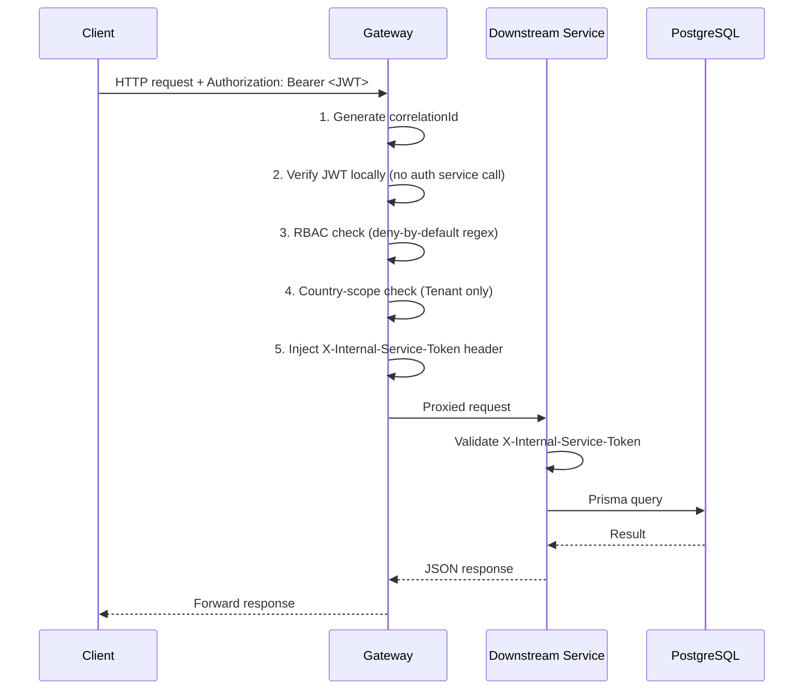
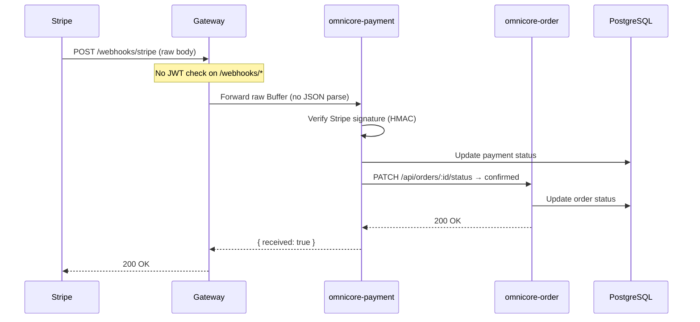
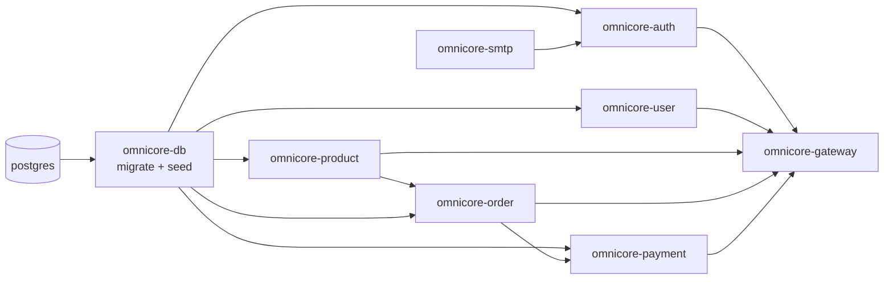

# Architecture

## 1. System Overview

Omnicore follows the **API Gateway + Microservices** pattern. A single gateway is the only entry point for clients. Each downstream service owns a specific business domain. All services share one PostgreSQL database managed through a single Prisma schema.

---

## 2. Service Map

| Service | Directory | Internal Port | Domain |
|---------|-----------|--------------|--------|
| API Gateway | `omnicore-gateway/` | 3000 (host: **3010**) | Routing, auth, RBAC |
| Auth Service | `omnicore-auth/` | 3003 | Signup, login, JWT, sessions |
| User Service | `omnicore-user/` | 3002 | User profiles, addresses, preferences |
| Product Service | `omnicore-product/` | 3001 | Products, countries, stock/pricing |
| Order Service | `omnicore-order/` | 3004 | Order lifecycle |
| Payment Service | `omnicore-payment/` | 3005 | Stripe integration, webhooks |
| SMTP Service | `omnicore-smtp/` | 3006 | Transactional email (Mailjet) |
| DB Runner | `omnicore-db/` | — | Migrations + seed (one-shot) |

> Internal services are reachable **only within the Docker network**. Only the gateway port is published to the host.

---

## 3. System Architecture Diagram

```mermaid
graph TB
    Client(["Client<br/>(Browser / Mobile / Postman)"])

    subgraph Docker Network — omnicore-network
        GW["API Gateway<br/>:3010 → :3000<br/>JWT · RBAC · Rate limit · Proxy"]

        subgraph Services
            AUTH["omnicore-auth<br/>:3003<br/>ESM"]
            USER["omnicore-user<br/>:3002<br/>ESM"]
            PROD["omnicore-product<br/>:3001<br/>CJS"]
            ORDER["omnicore-order<br/>:3004<br/>CJS"]
            PAY["omnicore-payment<br/>:3005<br/>CJS"]
            SMTP["omnicore-smtp<br/>:3006<br/>ESM"]
        end

        DB[("PostgreSQL :5432<br/>Single shared DB")]
        DBRUN["omnicore-db<br/>Migration runner<br/>(exits after seed)"]
    end

    Stripe(["Stripe API<br/>(external)"])

    Client -->|"HTTPS :3010"| GW

    GW -->|"/auth/*"| AUTH
    GW -->|"/api/users · addresses · preferences · audit-logs"| USER
    GW -->|"/api/products · countries · country-products"| PROD
    GW -->|"/api/orders"| ORDER
    GW -->|"/api/payments"| PAY
    GW -->|"X-Internal-Service-Token"| AUTH
    GW -->|"X-Internal-Service-Token"| USER
    GW -->|"X-Internal-Service-Token"| PROD
    GW -->|"X-Internal-Service-Token"| ORDER
    GW -->|"X-Internal-Service-Token"| PAY

    AUTH -->|"POST /mail/send"| SMTP
    ORDER -->|"PATCH /api/country-products/:id/stock"| PROD
    PAY -->|"GET · PATCH /api/orders/:id"| ORDER

    Stripe -->|"Webhook POST /webhooks/stripe"| GW

    AUTH --> DB
    USER --> DB
    PROD --> DB
    ORDER --> DB
    PAY --> DB
    GW --> DB
    DBRUN --> DB
```

---

## 4. Request Flow — Authenticated API Call



---

## 5. Request Flow — Payment (Stripe Webhook)



---

## 6. Internal Architecture Pattern (CJS services)

All CJS services (gateway, product, order, payment) follow the same layered pattern:

```
HTTP Request
    │
    ▼
routes/          → express.Router, validation rules (express-validator)
    │
    ▼
middlewares/     → auth, correlation, pino-http, error-handler
    │
    ▼
controllers/     → req/res handling only, delegates to service
    │
    ▼
services/        → business logic, orchestration
    │
    ▼
repositories/    → Prisma calls only, no business logic
    │
    ▼
@omnicore/db     → shared Prisma client singleton
    │
    ▼
PostgreSQL
```

---

## 7. Startup Dependency Order



`omnicore-db` runs migrations and seeds, then exits. All services wait for `service_completed_successfully` before starting.
