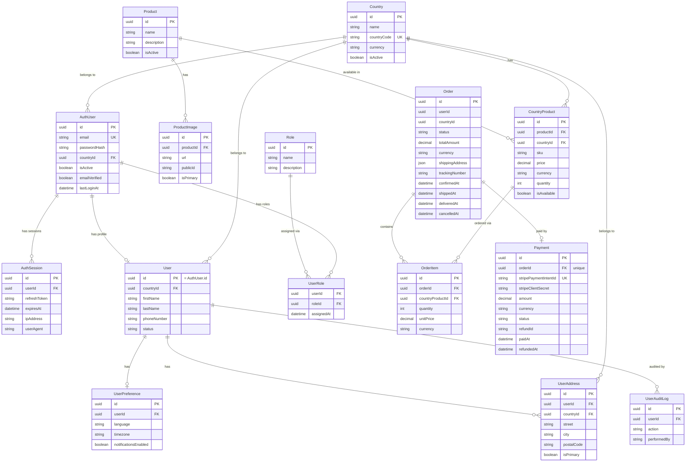

# Data Model

## 1. Overview

There is **one** Prisma schema for the entire platform, located at `omnicore-db/prisma/schema.prisma`.  
No service maintains its own schema or runs its own migrations.

All models map to a single PostgreSQL database (`zaraomni_db` in production Docker).

---

## 2. Entity Relationship Diagram



---

## 3. Key Design Decisions

### Product has no price or stock
`Product` stores only `name` and `description`. All pricing and inventory lives in `CountryProduct` — the junction between a product and the country it is sold in. This enables per-country pricing with the same product catalog.

### User identity is split across two models
`AuthUser` holds credentials (email, password hash, country, sessions).  
`User` holds the profile (name, phone, addresses). Both share the **same UUID** — `User.id = AuthUser.id`. The auth service creates the `AuthUser`; the user service creates the `User` profile linked by that same ID.

### Order status lifecycle
```
pending → confirmed → shipped → delivered   (terminal)
       ↘              ↘
        cancelled             cancelled     (terminal)
```
Status transitions are enforced in `omnicore-order/src/services/order.service.js`.

### Payment status lifecycle
```
pending → processing → succeeded   (terminal)
                    ↘ failed       (terminal)
         succeeded  → refunded     (terminal)
```
Stripe drives transitions via webhook. On full refund the linked order is automatically cancelled and stock is restored.

### CountryProduct stock is transactional
When an order is created, stock decrement is performed via `prisma.$transaction` (order + items in one transaction), then a service call to product patches `quantity`. If the product call fails, the order is still created but stock is noted as pending — an acknowledged gap for future event-driven architecture.

---

## 4. Migrations

All migrations live in `omnicore-db/prisma/migrations/`. They are applied automatically at startup by the `omnicore-db` Docker container running `prisma migrate deploy`.

To create a new migration:
```bash
npm run prisma:migrate -w @omnicore/db -- --name <migration_name>
```

To regenerate the Prisma client after a schema change:
```bash
npm run prisma:generate -w @omnicore/db
```
